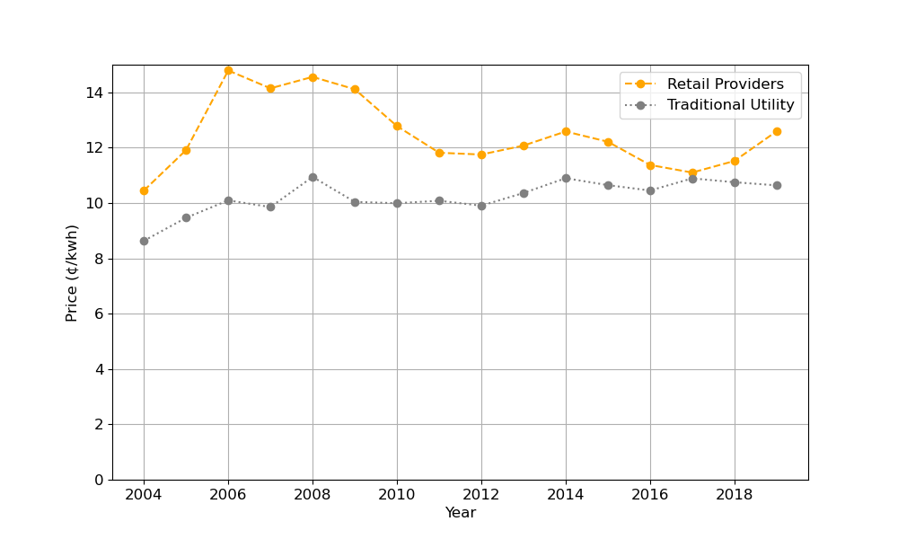
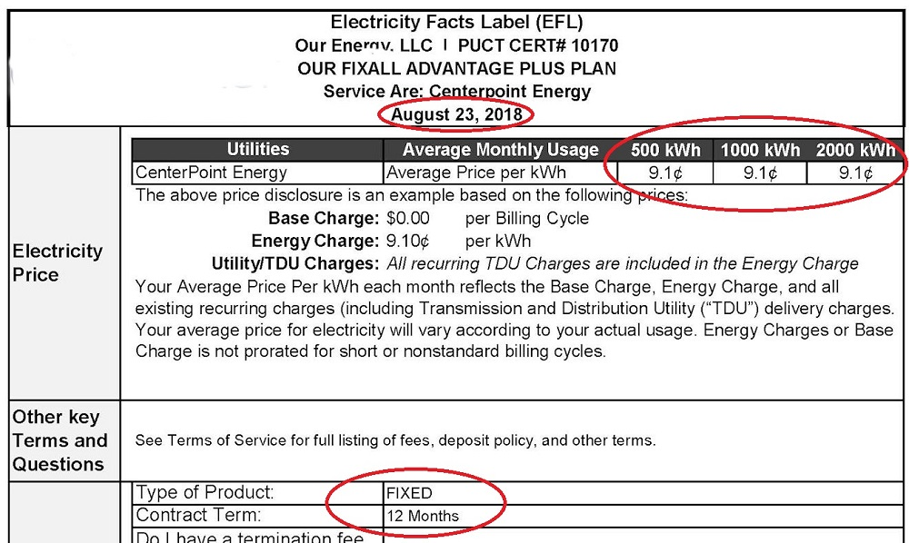
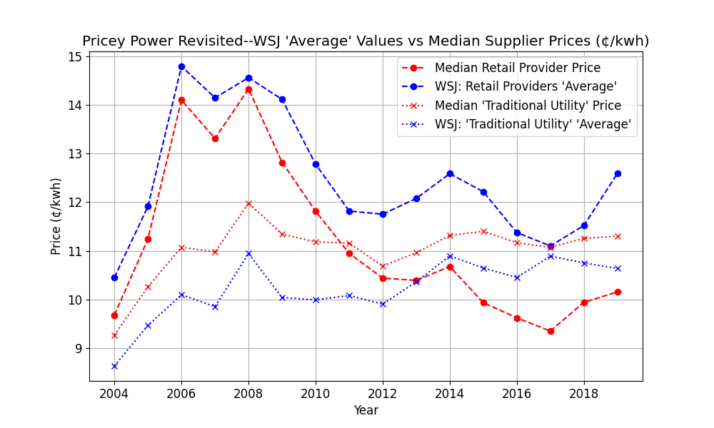

<h1 style="text-align: center;">The Price of Power</h1>
<h3 style="text-align: center;">A More Balanced View of Retail Power Prices in Texas</h3>
######

I read with interest the front-page Wall Street Journal article "[Texas Electric Bills Were $28 Billion Higher Under Deregulation](https://www.wsj.com/articles/texas-electric-bills-were-28-billion-higher-under-deregulation-11614162780?st=4669lbei6w8wzq0&reflink=desktopwebshare_permalink)" of February 24th of this year.  It promised an "analysis" of Texas retail power prices.  The headline graph and its title (reproduced here) seemed promising:
> ###Pricey Power###
> The roughly 60% of Texans who must choose a retail electricity provider consistently pay more than customers in the state who buy their power from traditional utilities.

>Source: Wall Street Journal analysis of U.S. Energy Information Administration data

The article then takes the price differential in this graph (elsewhere defined as a difference of 'average' prices for *residential customers only*), multiplies it by the amount of energy sold via retail providers, and *voila*: [28 *Billion Dollars*](https://youtu.be/BRAkobf-tVI?t=11).

Well, that seemed clear enough, except, as someone who regularly shops power suppliers as a retail consumer in Texas, the numbers seemed...***suspiciously high***.  For example, rummaging around in my records, I found:

And, I have a stack of similar or lower-priced records dating back to 2010. My 2018 contract renewal, and the others, seemed to be considerably below *both* the 'Retail Provider' and 'Traditional Utility' numbers provided in the article.  Well, it's not as if this is some obscure marketing scheme--each year, when my contract expires, I go to the puc-sponsored website [powertochoose.org](http://powertochoose.org), choose "12-month, fixed price, sorted" and *choose the lowest price.*  Not a lot of brainpower involved there.  So I have a stack of these 'EFLs' over the last 10 years with similar results, all lower that this graph.

### Questions raised, ***but not answered***: ###
1. So where is this data?  How can I analyze it myself?
1. Who are the 'Traditional Utilities' and 'Retail Providers'? What can be learned from the price comparison?  What are the limitations of such a comparison?
3. What is meant by 'average' price? Why are my results so different?
1. What has gone on in the (roughly 2/3) of the market for commercial and industrial customers?
1. How can I place this $28 Billion in context?  What are some insights that can be gained from this data?

***We will answer those questions in two parts.  This article will focus on questions 1-3, and a subsequent article will focus on 4-5.***

###Disclosures: Who am I, why am I writing this, and how can you trust me?###

I'll answer the last one first--*I'm giving you the code*...if you want, you can run it from the EIA files on their site [here](https://www.eia.gov/electricity/data/eia861/) all the way through each analysis step.  If you spot an error, or have an extension, I will gladly take [pull requests](https://docs.github.com/en/github/collaborating-with-issues-and-pull-requests).

As for who I am and why I'm doing this, I'm an independent energy consultant, and I'm not hard to find on [linkedin](https://www.linkedin.com/in/dale-furrow-68aa02166/). I have had retail power clients, but the views here are entirely my own, and this work isn't associated with any of my clients, past or present.  I'm writing this because (1) I don't think this data has been represented fairly, and (2) this is an interesting exercise in extracting, cleaning and analyzing a dataset using python, pandas, and matplotlib. and (3) I'm interested in promoting the accurate dissemination and analysis of public data, and this is a good example.

###Code, Formatting, Conventions###
All of the data and code supporting this article can be found [here](https://github.com/dkfurrow/eia-retail-analysis).  All of the code is in python (I used version 3.83).  The python files are in ordinary *.py format (i.e. they are not jupyter notebooks).  I have separated the code into 'code cells' consistent with those used by the [Spyder IDE](https://docs.spyder-ide.org/current/editor.html). 
###The Data###
The data are from data files the Energy Information Agencies Form EIA-861 data files [here](https://www.eia.gov/electricity/data/eia861/), and copied to github [here](https://github.com/dkfurrow/eia-retail-analysis/tree/master/data).  Those datafiles are in a series of spreadsheets embedded in zipfiles, one file per year.  In the zipfiles, there are spreadsheets, with each spreadsheet representing a customer sector, as follows:

| Table   | Customer Sector   |
|:--------|:------------------|
| table6  | residential       |
| table7  | commercial        |
| table8  | industrial        |
| table9  | transportation    |
| table10 | all               |

The data elements recorded are as follows:

| Columns   | Notes   |
|:----------|:--------|
| Entity    | Name of Company      |
| State     | Two-Character state abbreviation      |
| Ownership | Indicator for type of owner, e.g. 'Cooperative', 'Investor Owned'|
| Customers | Count of Customers   |
| Sales     | Sales volume in MWH     |
| Rev       | Sale revenue in $000    |
| AvgPrc    | Average price in Cents/KWH |

###Conversion and Cleaning###
The script to extract the EIA data is [here](https://github.com/dkfurrow/eia-retail-analysis/blob/master/eia_retail_extract.py).  It's too long to usefully excerpt here, I'll simply note the issues with clear, I'll simply note the process and issues:

1. From 2007 and previous, the EIA reversed the order of Revenue and Sales as noted in the table above.
1. The spreadsheet data started on different lines depending on the year, but always started with Alaska in the case of all sectors *except* Transportation, which started with Arkansas.
1. Some of the early year spreadsheets had an extraneous 8th ('Data Check') column, excluded here.
1. Some of the State values showed as Null, excluded here, likewise all rows where all of Revenue, Sales, and Customers were zero were excluded.

**Whew! Almost done....**

1. Checked that Rev/Sales = AvgPrc, which was true except in some cases where Ownership was 'Other' or 'Behind the Meter' (also Entity was 'adjustment'), in which case AvgPrc was null.  Our focus here isn't on adjustment or behind-meters sales, so I left the data as is.
1. Added feature 'OwneshipType' *['Reg', 'DeReg']* based on whether 'Ownership' is either 'Power Marketer' or 'Retail Provider'...it appears there was a change in terminology over the years.
2. Added columns 'Year' and 'CustClass' (i.e. 'commercial', 'industrial', 'residential', 'transportation', 'all'), converted the whole dataset to a 'records' format with Columns 'ValueType' to indicate Revenues, Sales, Customers or AvgPrc and 'Value' to indicate quantity, and then saved the whole thing to parquet for convenience.

###What can be learned here?###
Well, it's a comprehensive set revenue, cost and customer data, so one can certainly do both horizontal (across customer classes, entities, states) and vertical (across time) comparisons of those data.
###What are the limitations?###
You can most certainly *not* definitively ascertain the effectiveness of either a regulatory regime or market mechanism from this data, as implied in the reviewed article.  Most specifically, there is no data here on:

1. **Wholesale prices:** You can't normalize results with prices available via the (deregulated) wholesale bulk power market--that information isn't here.
1. **Distribution or 'Wires' charges:** retail customers pay a (regulated) fee to access their (unique) distribution system--that value is bundled in the results here.
1. **Generation and Load Characteristics** (Somewhat related to the above) There's no data here on 
	1. Weather/load characteristics [flatter, easier-to-predict loads *should be* cheaper to serve, regardless or regulatory choice]
	1. Local generation asset mix: Does the local utility own cheap hydro generation?  Or natural gas generation [subject to substantial price changes between 2004-2019]?  Are their (inefficient) assets maintained solely for reliability?
	1. Has the customer chosen (more expensive)renewable generation in lieu of fossil power?  That's a choice in Texas, and other states.

**So, it's important to have some humility here, and recognize what the data *can and cannot show.***

###So what are some useful preliminary findings of the data?###

Well, the basics:
We've extracted Texas records from total, that's 42,616 rows in total.  Focusing on the `Customer` ValueType, we have the following counts across all years:

    print(pd.DataFrame(tx_records[tx_records.ValueType == 'Customers']['CustClass'].value_counts()).to_markdown())

|CustClass                |   Count |
|:---------------|------------:|
| all            |        3150 |
| commercial     |        2935 |
| residential    |        2800 |
| industrial     |        1740 |
| transportation |          29 |

We're going to focus on the residential group here.

The 'Retail Provider' group ('DeReg' in our parlance) includes 158 unique names...but a much smaller subset in any one year.  The data don't include ownership, or unique identifiers, so we can't track name changes.  But in any case, here is the count over time.

|        |   2004 |   2005 |   2006 |   2007 |   2008 |   2009 |   2010 |   2011 |   2012 |   2013 |   2014 |   2015 |   2016 |   2017 |   2018 |   2019 |
|:-------|-------:|-------:|-------:|-------:|-------:|-------:|-------:|-------:|-------:|-------:|-------:|-------:|-------:|-------:|-------:|-------:|
| Entity |     26 |     31 |     31 |     33 |     45 |     49 |     50 |     54 |     60 |     56 |     60 |     63 |     64 |     66 |     66 |     68 |

    deregs = tx_records[(tx_records.OwnershipType == 'DeReg') & (tx_records.CustClass == 'residential') &
       (tx_records.ValueType == 'Customers') & (tx_records.Value > 0.)]
    print('Unique Dereg Entities over all time: {0:,}'.format(len(deregs['Entity'].unique())))
    print('Unique Dereg Entities: {0:,}'.format(len(deregs[deregs['Year'] == 2019]['Entity'].unique())))
    print(deregs.pivot_table(values='Entity', columns='Year', aggfunc='count').to_markdown())
    
The 'Traditional Utilities' group is of course more stable over time, but they have little in common, other than they serve customers in the 270K square mile state.  They span multiple ownership types, all three North American interconnects, multiple climates, and types/levels of asset ownership.  In 2019, there were 139 such entities, in the following categories:

| Type             |   Ownership |
|:-----------------|------------:|
| Cooperative      |          66 |
| Municipal        |          65 |
| Investor Owned   |           4 |
| Behind the Meter |           3 |
| Other            |           1 |
| Total            |         139 |

    regs = tx_records[(tx_records.OwnershipType == 'Reg') & (tx_records.CustClass == 'residential') &
       (tx_records.ValueType == 'Customers') & (tx_records.Value > 0.)]
    value_counts = pd.DataFrame(regs[regs.Year == 2019]['Ownership'].value_counts())
    total= value_counts.sum(axis=0).astype('int64')
    total.name = 'Total'
    value_counts = value_counts.append(total)
    value_counts.index.name = "Type"
    print(value_counts.to_markdown())
    
Anyway, we should get on to examining prices.

###Okay, what's this 'average' price?###
So we can copy the article data straight from the html (we actually did that previously--it's json data, appears to be feeding a d3.js routine).  We then exploit pandas pivot table functionality to get simple averages and medians for traditional utilities and retail providers.  Finally, we graph the medians vs the articles' 'averages' using Matplotlib.  That code is [here](https://github.com/dkfurrow/eia-retail-analysis/blob/master/eia_retail_analysis1.py).

