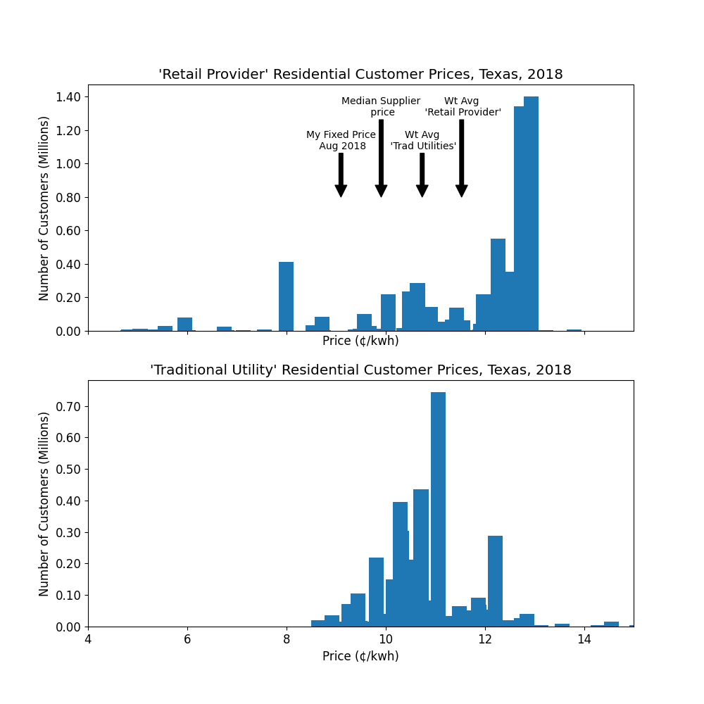

<h1 style="text-align: center;">The Price of Power</h1>
<h3 style="text-align: center;">A More Balanced View of Retail Power Prices in Texas</h3>
######

I read with interest the front-page Wall Street Journal article "[Texas Electric Bills Were $28 Billion Higher Under Deregulation](https://www.wsj.com/articles/texas-electric-bills-were-28-billion-higher-under-deregulation-11614162780?st=4669lbei6w8wzq0&reflink=desktopwebshare_permalink)" of February 24th of this year.  It promised an "analysis" of Texas retail power prices.  The headline graph and its title (reproduced here) seemed to provide some definitive information:
> ###Pricey Power###
> The roughly 60% of Texans who must choose a retail electricity provider consistently pay more than customers in the state who buy their power from traditional utilities.

>Source: Wall Street Journal analysis of U.S. Energy Information Administration data

The article then takes the price differential in this graph (elsewhere defined as a difference of 'average' prices for *residential customers only*), multiplies it by the amount of energy sold via retail providers, and *voila*: [28 *Billion Dollars*](https://youtu.be/BRAkobf-tVI?t=11).

Well, that seemed clear enough, except, as someone who regularly shops power suppliers as a retail consumer in Texas, the numbers seemed...***suspiciously high***.  For example, rummaging around in my records, I found:

And, I have a stack of similar or lower-priced records dating back to 2010. My 2018 contract renewal, and the others, seemed to be considerably below *both* the 'Retail Provider' and 'Traditional Utility' numbers provided in the article.  Well, it's not as if I utilize some obscure marketing scheme--each year, when my contract expires, I go to the PUC-sponsored website [powertochoose.org](http://powertochoose.org), choose "12-month, fixed price, sorted" and *select the provider with the lowest price.*  Not a lot of brainpower involved there (although occasionally I have seen some plans which have different prices based on usage, so that *does* require some math).  In any case, I have a stack of these '[EFLs](https://www.puc.texas.gov/industry/electric/rates/Default.aspx)' over the last 10 years with similar results, all lower than *both lines* this graph.

### Questions raised, ***but not answered***: ###
1. So where is this data?  How can I analyze it myself?
1. Who are the 'Traditional Utilities' and 'Retail Providers'? What can be learned from the price comparison?  What are the limitations of such a comparison?
1. What is meant by 'average' price?  The article clarifies, below the graph: "The Journal calculated separate annual statewide rates for utilities and retailers by adding up all of the revenue each type of provider received and dividing it by the kilowatt-hours of electricity it sold." So that's a weighted-average price (total retailer revenues divided by total retailer sales).  How well does *that* measure of central tendency summarize the typical customer experience? Why are my results so different?
1. What has transpired in the (roughly 2/3) of the market for commercial and industrial customers?  Why is *that* not part of this story?
1. How can I place this $28 Billion in context?  What are some other insights that can be gained from this data?

***We will answer those questions in two parts.  This article will focus on questions 1-3, and a subsequent article will focus on 4-5.***

###Disclosures: Who am I, why am I writing this?###

So this is largely a story about data and the problems with using one summary statistic to represent a dynamic and varied market.  You don't need a background in energy to gain something from this analysis, but nonetheless that is my background. I've spent the last decade or so as an independent energy consultant; on linkedin, here's [my profile](https://www.linkedin.com/in/dale-furrow-68aa02166/).  Previously, I worked in wholesale power trading and risk management. As a consultant, I have had retail power clients[but also banks, refiners, oil traders, etc]. But the point I'd like to make is: *the views here are entirely my own, and this work isn't associated with any of my clients, past or present.*  I'm writing this because 

1. I think this data tells a more interesting story than has been portrayed, 
1. The authors of the article didn't see fit to make their analysis or the [cleaned] dataset public, 
1. This is an interesting exercise in extracting, cleaning and analyzing a dataset using python, pandas, and matplotlib. and
1. I'm interested in promoting the accurate dissemination and analysis of public data--this is a good example.

###Code, Formatting, Conventions###
All of the data and code supporting this article can be found on github [here](https://github.com/dkfurrow/eia-retail-analysis). If you spot an error, or have an extension, I will gladly take [pull requests.](https://docs.github.com/en/github/collaborating-with-issues-and-pull-requests) All of the code is in python (I used version 3.83, specifically the [winpython distribution](https://winpython.github.io/)).  The python files are in ordinary *.py format (i.e. they are not jupyter notebooks).  I have separated the code into 'code cells' consistent with those used by the [Spyder IDE](https://docs.spyder-ide.org/current/editor.html), and I'll identify the code block in which you can find any particular analysis below. 
###The Data###
The data here originate from the Energy Information Agency's Form EIA-861 data files [here](https://www.eia.gov/electricity/data/eia861/), and copied to github for convenience [here](https://github.com/dkfurrow/eia-retail-analysis/tree/master/data).  Those datafiles are in a series of spreadsheets embedded in zipfiles, one file per year.  In the zipfiles, there are spreadsheets, with each spreadsheet representing a customer sector, as follows:

| Table   | Customer Sector   |
|:--------|:------------------|
| table6  | `residential`       |
| table7  | `commercial`        |
| table8  | `industrial`        |
| table9  | `transportation`    |
| table10 | `all`               |

The data elements recorded are as follows:

| Columns   | Explanation   |
|:----------|:--------|
| `Entity`    | Name of Company      |
| `State`     | Two-Character state abbreviation      |
| `Ownership` | Indicator for type of owner, e.g. 'Cooperative', 'Investor Owned'|
| `Customers` | Count of Customers   |
| `Sales`     | Sales volume in MWH     |
| `Rev`       | Sale revenue in $000    |
| `AvgPrc`    | Average price in &#162;/KWH |

###Conversion and Cleaning###
The script to extract the EIA data is [here](https://github.com/dkfurrow/eia-retail-analysis/blob/master/eia_retail_extract.py).  It's too long to usefully excerpt here, so I'll simply note the issues with cleaning the data addressed by this script:

1. From 2007 and previous, the EIA reversed the order of Revenue and Sales as noted in the table above.
1. The spreadsheet data started on different lines depending on the year, but always started with Alaska in the case of all sectors *except* Transportation, which started with Arkansas.
1. Some of the early year spreadsheets had an extraneous 8th ('Data Check') column, excluded here.
1. Some of the State values showed as Null, excluded here, likewise all rows where all of Revenue, Sales, and Customers were zero were excluded.

**So once the data is pulled from the zipfiles and fixed in accordance with above....**

1. I checked that Rev/Sales = `AvgPrc`, which was true except in some cases where `Ownership` was 'Other' or 'Behind the Meter' (also `Entity` was 'adjustment'), in which case `AvgPrc` was null.  Our focus here isn't on adjustment or behind-meters sales, so I left the data as is.
1. Added feature `OwneshipType` *['Reg' or 'DeReg']* based on whether `Ownership` is *either* 'Power Marketer' *or* 'Retail Provider'...it appears there was a change in terminology over the years.
2. Added features `Year` and `CustClass` (i.e. `'commercial', 'industrial', 'residential', 'transportation', 'all'`), converted the whole dataset to a 'records' format with Columns `'ValueType'` to indicate Revenues, Sales, Customers or AvgPrc and `Value` to indicate quantity, and then saved the whole thing to parquet for convenient use in other scripts.

So at this point, we have a records table of individual `Rev, Sales, Customers` *or* `AvgPrc` elements 650,900 rows by 8 columns, `Year` 2004-2019: 

###What can be learned here?###
Well, it's a comprehensive set of revenue, cost and customer data, so one can certainly do both categorical (across customer classes, ownership types,  entities, states) and temporal (across years) comparisons of sales volumes, number of customers, and revenues (with implied unit prices).  You can look at market concentration or growth of customer base, for example; there's a lot of potential directions to take here.
###What are the limitations?###
You can most certainly *not* definitively ascertain the effectiveness of either a regulatory regime or market mechanism from this data alone, in contrast to the quote in the reviewed article "high statewide prices relative to the national average “must be attributed to the deregulated sector of Texas".  Most specifically, there is no data here on:

1. **Wholesale prices:** You can't normalize results with prices available via the ([deregulated](https://www.ferc.gov/sites/default/files/2020-05/rm95-8-00v.txt)) wholesale bulk power market--that information isn't here.
1. **Distribution or 'Wires' charges:** retail customers pay a (regulated) fee to access their (unique) distribution system--that value is bundled in the total price results here.
1. **Generation and Load Characteristics** (Somewhat related to the above) There's no data here on 
	1. Weather/load characteristics [flatter, easier-to-predict loads *should be* cheaper to serve, regardless of regulatory choice or market design alternative]
	1. Local generation asset mix, e.g. Does the local utility own (cheap) hydro generation?  Or natural gas generation [a fuel subject to substantial price changes between 2004-2019]?  Are the local coal plants [scrubbed](https://www.gem.wiki/Scrubbers#:~:text=Scrubbers%20are%20an%20apparatus%20that,the%20formation%20of%20acid%20rain.), or equipped with [SCRs](https://en.wikipedia.org/wiki/Selective_catalytic_reduction), and if so, when did the installation go into rate base?  Are there (non-market-competitive) assets maintained solely for reliability?
	1. Can the customer choose (more expensive)renewable generation in lieu of fossil power?  That's a choice in Texas, and one that carries cost implications.

**So, it's important to have some humility here, and recognize what the data *can and cannot show.  Simple price analysis is a necessary but insufficient method to determine the impact of retail electric deregulation.***

###So what are some useful preliminary findings of the data?###

We'll cover a few basics:
We've extracted Texas records from total, that's 42,616 rows in total.  Focusing on the `Customer` ValueType, we have the following counts across all years:

    print(pd.DataFrame(tx_records[tx_records.ValueType == 'Customers']['CustClass'].value_counts()).to_markdown())

|CustClass                |   Count |
|:---------------|------------:|
| all            |        3150 |
| commercial     |        2935 |
| residential    |        2800 |
| industrial     |        1740 |
| transportation |          29 |

We're going to focus on the residential group in this article--we'll get to the other classes later.

The 'Retail Provider' group ('DeReg' in our parlance) includes 158 unique names...but a much smaller subset in any one year.  The data don't include ownership, or any unique identifiers, so we can't track name changes or identify market concentration through ownership.  But in any case, we can see the growth in supplier count as observed by the customer. Here is the count over time.

|        |   2004 |   2005 |   2006 |   2007 |   2008 |   2009 |   2010 |   2011 |   2012 |   2013 |   2014 |   2015 |   2016 |   2017 |   2018 |   2019 |
|:-------|-------:|-------:|-------:|-------:|-------:|-------:|-------:|-------:|-------:|-------:|-------:|-------:|-------:|-------:|-------:|-------:|
| Entity |     26 |     31 |     31 |     33 |     45 |     49 |     50 |     54 |     60 |     56 |     60 |     63 |     64 |     66 |     66 |     68 |

    deregs = tx_records[(tx_records.OwnershipType == 'DeReg') & (tx_records.CustClass == 'residential') &
       (tx_records.ValueType == 'Customers') & (tx_records.Value > 0.)]
    print('Unique Dereg Entities over all time: {0:,}'.format(len(deregs['Entity'].unique())))
    print('Unique Dereg Entities: {0:,}'.format(len(deregs[deregs['Year'] == 2019]['Entity'].unique())))
    print(deregs.pivot_table(values='Entity', columns='Year', aggfunc='count').to_markdown())
For 2019, we can 'bin' the 68 retailers by customer size:

Total Customers: 6,451,123

| Retailer Size       |   Retailer Count |
|:--------------------|-----------------:|
| 1-10                |                2 |
| 10-100              |                5 |
| 100-1,000           |                7 |
| 1,000-10,000        |               16 |
| 10,000-100,000      |               24 |
| 100,000-500,000     |               11 |
| 500,000-1,000,000   |                1 |
| 1,000,000-2,000,000 |                2 |
Total Retailers: 68

    bin_data = deregs[deregs.Year == 2019]['Value']
    print("Total Customers: {0:,.0f}".format(bin_data.sum()))
    retailer_size = [1, 10, 100, 1000, 10000, 100000, 500000, 1000000, 2000000]
    bin_table = pd.cut(x = bin_data, bins=retailer_size).value_counts().sort_index()
    retailer_ind = pd.Index(["{0:,}-{1:,}".format(x.left, x.right) for x in bin_table.index], name='Retailer Size')
    bin_table.index = retailer_ind
    bin_table.name='Retailer Count'
    print(bin_table.to_markdown())
    print("Total Retailers: {0:d}".format(bin_table.sum()))

And we can see a highly asymmetric concentration of customers among a few large suppliers.  We'll return to that theme below.
    
The 'Traditional Utilities' group is of course more stable over time, but they have little in common, other than they serve customers in the 270K square mile state of Texas.  They span multiple ownership types, all three major [North American interconnects](https://www.energy.gov/oe/services/electricity-policy-coordination-and-implementation/transmission-planning/recovery-act-0#:~:text=North%20America%20is%20comprised%20of,(excluding%20most%20of%20Texas).), multiple climates, and types/levels of asset ownership.  In 2019, there were 139 such entities, in the following categories:

| Ownership        |   Count |   Customers |       Rev |      Sales |
|:-----------------|--------:|------------:|----------:|-----------:|
| Behind the Meter |       3 |      10,079 |    12,132 |     94,715 |
| Cooperative      |      66 |   2,047,389 | 3,262,208 | 30,801,891 |
| Investor Owned   |       4 |   1,058,102 | 1,356,561 | 12,983,489 |
| Municipal        |      65 |   1,796,557 | 2,406,103 | 22,382,885 |
| Other            |       1 |       3,389 |    20,809 |    158,311 |
| Total            |     139 |   4,915,516 | 7,057,813 | 66,421,291 |

    # characterize regulated entities
    res_tx_2019_reg = tx_records[(tx_records['Year'] == 2019) & (tx_records['CustClass'] == 'residential') &
       (tx_records['OwnershipType'] == 'Reg')]
    res_tx_2019_reg_pivot = res_tx_2019_reg.pivot_table(values='Value', index=['Ownership', 'Entity'], columns='ValueType')
    res_tx_2019_reg_pivot.drop('AvgPrc', axis=1, inplace=True)
    sums = res_tx_2019_reg_pivot.sum(axis=0, level=0)
    # print(res_tx_2019_reg_pivot.sum(axis=0, level=0).to_markdown(floatfmt=",.0f"))
    entity_count = res_tx_2019_reg_pivot.count(axis=0, level=0)['Customers']
    sums.insert(loc=0, column='Count', value=entity_count.values)
    total= sums.sum(axis=0)
    sums.loc['Total', :] = total
    print(sums.to_markdown(floatfmt=",.0f"))
    
Anyway, we should get on to examining prices.

###Okay, what's this 'average' price?###
So we can copy the article data straight from the html (we actually did that previously--it's json data from the article html).  

We then exploit pandas pivot table functionality to get simple averages and medians for traditional utilities and retail providers, and compare the article data to those calculated values.  That result is:

|Value                                 |   2004 |   2005 |   2006 |   2007 |   2008 |   2009 |   2010 |   2011 |   2012 |   2013 |   2014 |   2015 |   2016 |   2017 |   2018 |   2019 |
|:-------------------------------------|-------:|-------:|-------:|-------:|-------:|-------:|-------:|-------:|-------:|-------:|-------:|-------:|-------:|-------:|-------:|-------:|
| Calc DeReg Mean     |   9.68 |  11.24 |  14.10 |  13.31 |  14.33 |  12.82 |  11.81 |  10.95 |  10.44 |  10.39 |  10.68 |   9.93 |   9.62 |   9.35 |   9.94 |  10.16 |
| Calc DeReg Median   |   9.81 |  11.20 |  14.37 |  13.21 |  14.75 |  12.80 |  11.66 |  10.57 |  10.46 |  10.31 |  10.89 |  10.35 |   9.88 |   9.56 |   9.91 |  10.23 |
| **WSJ DeReg 'Average'** |  10.45 |  11.91 |  14.79 |  14.15 |  14.56 |  14.11 |  12.78 |  11.82 |  11.75 |  12.08 |  12.59 |  12.22 |  11.38 |  11.10 |  11.52 |  12.59 |
| Calc Reg Mean       |   9.27 |  10.26 |  11.07 |  10.98 |  11.98 |  11.34 |  11.19 |  11.16 |  10.69 |  10.96 |  11.32 |  11.40 |  11.17 |  11.07 |  11.26 |  11.30 |
| Calc Reg Median     |   9.16 |  10.12 |  10.91 |  10.77 |  11.94 |  11.29 |  10.99 |  10.80 |  10.46 |  10.54 |  11.38 |  11.14 |  10.71 |  11.13 |  10.95 |  10.95 |
| **WSJ Reg 'Average'**   |   8.63 |   9.47 |  10.10 |   9.86 |  10.94 |  10.04 |   9.99 |  10.08 |   9.90 |  10.36 |  10.90 |  10.65 |  10.45 |  10.89 |  10.75 |  10.64 |

So right away, we can see that:

1. The article values **in bold** will have to be either weighted averages (as indicated by the quote above), or they are inconsistent with this data...we'll accept them as weighted averages for now, but we'll do that consistency check below.
2. The price distribution by sales must be *significantly skewed* for retail providers. For the most recent year, the weighted average is 24% above the median supplier's price. By contrast, for 'Traditional Utilities' that difference is minimal.
3. My 2018-2019 fixed price contract detailed above makes a lot more sense now...below the median, but closer to that than to the weighted average.

We definitely should do a visualization here...all 6 rows would be a bit busy, so we'll drop the 'simple mean' values.  The code is [block 1, here](https://github.com/dkfurrow/eia-retail-analysis/blob/master/eia_retail_analysis1.py).

So this allows us to see the trends a little better.  So we see here that (1) the median retail provider's price dropped below the median 'traditional utility's' price around 2011 and stayed below.  (2) the median retail provider's price is always below the 'weighted average', but that spread has increased for more recent data.

### Confirm weighted average ###

So, making use of pandas pivot_table and multi-index capabilities, we calculate a weighted average and compare...[block 2, here](https://github.com/dkfurrow/eia-retail-analysis/blob/master/eia_retail_analysis1.py)

|                                       |   2004 |   2005 |   2006 |   2007 |   2008 |   2009 |   2010 |   2011 |   2012 |   2013 |   2014 |   2015 |   2016 |   2017 |   2018 |   2019 |
|:--------------------------------------|-------:|-------:|-------:|-------:|-------:|-------:|-------:|-------:|-------:|-------:|-------:|-------:|-------:|-------:|-------:|-------:|
| Calc DeReg Median |  10.45 |  11.91 |  14.79 |  14.15 |  14.57 |  14.13 |  12.79 |  11.81 |  11.75 |  12.07 |  12.57 |  12.21 |  11.37 |  11.11 |  11.53 |  12.61 |
| **WSJ DeReg 'Average'**  |  10.45 |  11.91 |  14.79 |  14.15 |  14.56 |  14.11 |  12.78 |  11.82 |  11.75 |  12.08 |  12.59 |  12.22 |  11.38 |  11.10 |  11.52 |  12.59 |
| Calc Reg Median   |   8.63 |   9.47 |  10.10 |   9.86 |  10.95 |  10.06 |  10.01 |  10.10 |   9.93 |  10.39 |  10.93 |  10.67 |  10.47 |  10.88 |  10.74 |  10.63 |
| **WSJ Reg 'Average'**    |   8.63 |   9.47 |  10.10 |   9.86 |  10.94 |  10.04 |   9.99 |  10.08 |   9.90 |  10.36 |  10.90 |  10.65 |  10.45 |  10.89 |  10.75 |  10.64 |

So we basically tie on weighted average...certainly down to the &#162;0.1/kwh level (1 [mill](https://www.statista.com/statistics/195814/us-power-plant-operating-expenses-since-1998/)).

###Why are my results so different from 'Average' ?###

Well, we've definitely got a clue from the work we've accomplished thus far...this distribution is highly skewed.  Why?  Time for a bar chart, let's look at 2018 results [block 3, here](https://github.com/dkfurrow/eia-retail-analysis/blob/master/eia_retail_analysis1.py).

So, some of the companies with *the most customers* also charge *the highest prices.*  But there are 66 suppliers represented here, many with substantially better pricing than the *weighted average.* 

By the way, it's fair to repeat: in an unregulated market, simple price may not be the only issue...a customer might value Green power, for example, and be willing to pay for it.  Companies offer 'stable bill' plans, for example, where the 12-month total absolute bill is constant--a form of insurance.  Finally, in cases like my EFL above, there's implicit financing--I lend money to my supplier in off-peak months, my supplier lends money to me in peak months.

So, who are those large suppliers on the right side of the graph ([block 4, here](https://github.com/dkfurrow/eia-retail-analysis/blob/master/eia_retail_analysis1.py))?

| Entity                         |   AvgPrc |    Customers |          Rev |         Sales |
|:-------------------------------|---------:|-------------:|-------------:|--------------:|
| TXU Energy Retail Co, LLC      |    12.93 | 1,402,204 | 2,685,755 | 20,773,115 |
| Reliant Energy Retail Services |    12.74 | 1,340,640 | 2,370,478.20 | 18,609,917 |
| Direct Energy Services         |    12.27 |   552,372 |   885,977.40 |  7,219,715 |
| Ambit Energy Holdings, LLC     |     7.99 |   410,791 |   441,364 |  5,523,891 |
| Green Mountain Energy Company  |    12.44 |   355,016 |   530,030.20 |  4,259,048 |

No surprise here...they are the retail arms of the legacy regulated retail providers for the Dallas and Houston--and they drive the price distribution skew. (Also note GMER--not necessarily comparable to the others because their product is green energy vs slice-of-system sales)

So to summarize, we started with an article in the business press, in which the authors used a weighted average price graph of a subsection of the electricity market to spin a large, headline-grabbing dollar cost attributed to 'deregulation'.  Here, I've demonstrated how to pull the data, and provided a more detailed analysis. I'm hopeful this analysis demonstrates the inappropriateness of a simplistic weighted-average calculation to summarize a market situation which is actually *significantly skewed* between (2018 numbers, [block 5](https://github.com/dkfurrow/eia-retail-analysis/blob/master/eia_retail_analysis1.py)) a large group of customers who remain with legacy incumbents at higher prices (2.7MM, &#162;12.8/kwn) and a similarly large group of customers who have chosen alternate suppliers at lower prices (3.6MM, &#162;9.9/kwh).  A more realistic view of the data on residential retail power in Texas demonstrates that customers who switch from legacy providers (especially in recent years) gain a clear benefit, *both* compared to those legacy providers *and* compared to the 'traditional utilities' used for comparison (with caveats to that comparison as noted above).  

Finally, the data and code are posted, so you have the opportunity to decide for yourself the appropriateness of the analysis, and create an extension or an alternative.  I'm hopeful this article and associated [github repo](https://github.com/dkfurrow/eia-retail-analysis) provides some useful example code concerning the use of python, pandas and matplotlib in the cleaning, processing, analysis and visualization of this data.

For the next article, we'll consider the other sectors of the Texas electric retail market, and do some more in-depth analysis of the residential retail market discussed here.
